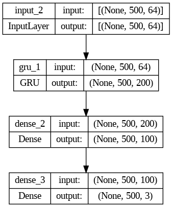
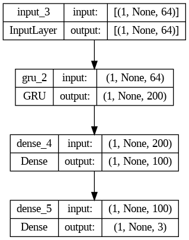
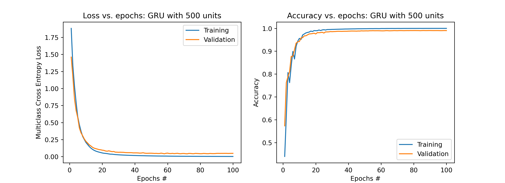

# Language Classification

One can directly run the `LanguageDetection_RNN.ipynb` notebook to access all the codes and text and solve this problem. Alternatively, you can run the `.py` files separately according to the following instructions.

The codes are divided into 3 parts:
- Pre-processing (PreProcessing.py)
- RNN training (RNN_train.py)
- RNN streaming (RNN_stream.py)

- An example of a Recurrent Neural Network (RNN) is displayed below:

  
## <u>**`PreProcessing.py`**</u>:

This takes each of the audio files at a time and first removes the silence from each file. For removing the silence, `librosa.effects.split` was used to find the non-silent intervals, and then only these intervals were considered to generate the features. Those intervals that were not returned were removed. Then, for each non-silent 1-D array of data loaded, `librosa.feature.mfcc` was used to generate the MFCC features of it and split it into sequences of length, which was set to 500 here. Simply put, after combining all audio files for each class, there will be `(N_seq_class, N_seqLength, N_features) = (N_seq_class, 500, 64)`. Then it generates class labels of shape `(N_seq_class, 500, 3)` for each class. The labels are set to be 1-hot arrays `[1, 0, 0]`, `[0, 1, 0]` and `[0, 0, 1]` for English, Hindi and Mandarin, respectively.
Then all these classes data are concatenated and shuffled to randomize the order of sequences. To concatenate the data, we trimmed the portion of data of each class that remained after dividing the number of total instants by 500. The last 10% of the combined data is then used as the unseen test data that was used in RNN streaming. From the rest 90%, the train-validation ratio was set to 80%-20%. After doing this, the data are saved as arrays of X_train, y_train, X_test, and y_test in `Data.hd5 `file.

## <u>**`RNN_train.py`**</u>:

This loads the training data from `Data.hd5` file generated after running PreProcessing.py. After testing for different architectures, I found 200 GRU units and an extra hidden layer with 100 units and ReLU activation would be an efficient method for training. It took each epoch ~ 26 seconds to complete and the validation accuracy lied around 90%. I ran the training for 100 epochs with the batch size of 128 and the validation split of 20%. I also used class weighting based on the portion of each class contributing to the entire data. The resulting weights of the trained model were saved as weights.hdf5 after fitting the abovementioned model to the training data. This weight file were later used for streaming model.

The architecture of both the training and the streaming models are shown below:

| Training Model Architecture | Streaming Model Architecture |
| :---: | :---: |
|  |  |

Also, the learning curves for this training procedure are shown below:

## <u>**`RNN_stream.py`**</u>:

In this part, we load the training model weights from weights.hd5 file obtained in the training. The resulting model in this code is saved as stream_RNN.hdf5. With setting the batch_shape to `(1, None, 64)`, I set up two streaming modes. The first streaming mode flag is `demo` that is used to print the probability output for classes predicted by the streaming model and also the true one-hot true label at each sequence (s from N_sequence) and instant (n from 500 – as the sequence length). The other mode is `pred_acc`, which is used to return the prediction accuracy of the streaming model for the unseen test set. Below is shown an example of `Demo` for a few instants and also `pred_acc` for the entire test set:

---

